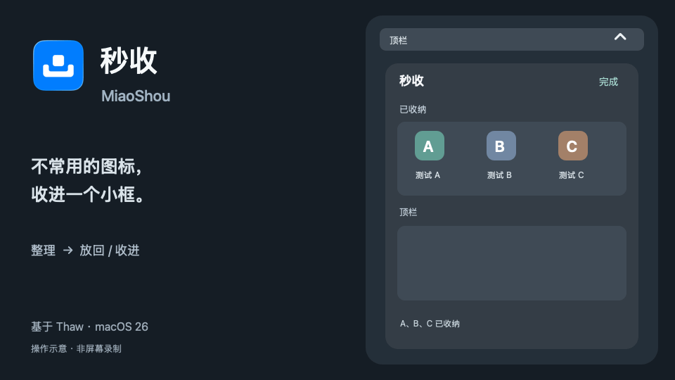
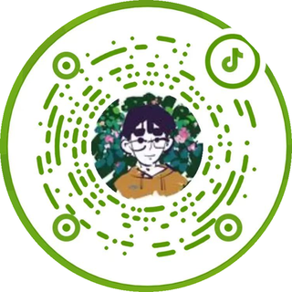
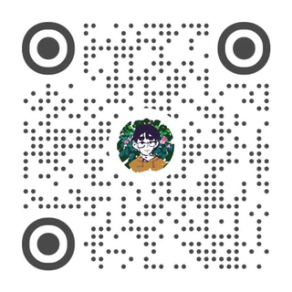

<div align="center">

# 菜单收纳 · Tray Box

把 Mac 顶栏里不常用的图标收进一个小框，需要时再打开。

<p><b>简体中文</b> · <a href="README.en.md">English</a></p>


<br><br>


操作示意，使用虚构的 A、B、C 图标；不是屏幕录制或性能测量。

</div>

## 下载与构建

| 系统 | 下载 |
|---|---|
| macOS 26、Apple Silicon | **[下载 0.4.0 源代码](https://github.com/AppApp777/tray-box/releases/download/v0.4.0/tray-box-0.4.0-source.zip)** |

本次发布的是源代码，需要用 Xcode 自行构建，步骤见下方“从源码构建”。尚未提供经过 Apple 公证、供直接安装的软件包。下载内容与校验和列在[版本页面](https://github.com/AppApp777/tray-box/releases/tag/v0.4.0)。

## 使用

- **收起来**：点顶栏收纳按钮，打开小框；点图标，使用原应用菜单。
- **放进放出**：点“整理”，在“已收纳”和“顶栏”两组里点“↑ 放回”或“↓ 收进”，也可以在两组之间拖动。
- **随手关闭**：点框外或按 Escape 关闭；拖动和移动图标时，框保持打开。

目前验证了整理框内的组间拖动。直接从原生顶栏拖进框、全屏、菜单栏自动隐藏和复杂多屏切换仍需进一步验证；系统固定图标可能无法移动。完整范围见[验证说明](docs/VALIDATION.md)。

## 权限与隐私

首次使用，需要在“系统设置 → 隐私与安全性”中为程序开启：

- **辅助功能**：移动图标、打开原应用菜单。
- **屏幕与系统音频录制**：获取菜单栏图标的画面。

图标画面仅缓存在内存，菜单栏处理在本机完成；程序不收集使用数据。本地版禁用了上游自动更新。卸载时先从顶栏按钮的右键菜单退出，再删除“菜单收纳.app”；偏好设置不会随应用文件自动删除。

## 许可与来源

菜单收纳基于 [Thaw 2.0.1](https://github.com/thaw-app/Thaw)，Thaw 源自 [Ice](https://github.com/jordanbaird/Ice)。本项目保留完整底层，增加简洁的收纳框与整理交互，并修复相关缓存和窗口状态问题。它是独立派生项目，不代表上游官方发布。

代码采用 [GNU GPLv3](LICENSE)：可以使用、修改和再分发；分发修改版本时，需要遵守同一许可并提供相应源码。上游版权及许可声明保留。具体改动见[来源说明](docs/UPSTREAM.md)，页面图片的来源与许可见[素材说明](docs/ASSET_LICENSE.md)。

## 反馈与更新

问题和建议请记在 [Issues](https://github.com/AppApp777/tray-box/issues)，说明系统版本、显示器情况、涉及的应用以及操作步骤。

**2026-10-04 · 0.4.0**：首次公开源码。完整[更新记录](CHANGELOG.md)。

## 关于作者

七也，做自己日常会用的小工具，也记录制作过程。

| 抖音 | 小红书 |
|:---:|:---:|
|  |  |
| 七也 · `miao1162603325` | 七也 · 扫码查看主页 |

<details>
<summary><b>从源码构建</b></summary>

需要 Apple Silicon Mac、macOS 26、Xcode 26.6，以及自己的 Apple Development 代码签名证书。首次构建会下载版本已锁定的开发依赖。

```sh
git clone https://github.com/AppApp777/tray-box.git
cd tray-box
./scripts/build.sh
```

成品位于 `build/release.noindex/菜单收纳.app`。将它复制到固定的 Applications 目录后，再为该副本授权。开发签名适合自行构建与测试，不等于公开分发签名或 Apple 公证。

有多个证书时，用 `TRAY_SIGNING_IDENTITY` 指定自己的签名身份；脚本不会自动创建、上传或修改证书。运行定向回归用 `./scripts/test.sh`。工程与测试说明见[开发文档](docs/DEVELOPMENT.md)。

</details>
